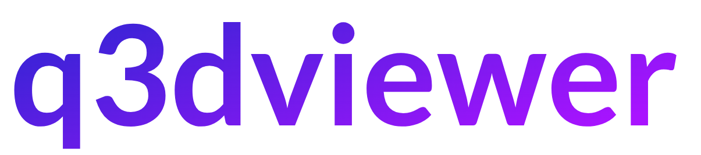
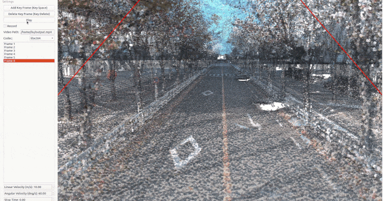

[](https://opensource.org/licenses/MIT)
[](https://badge.fury.io/py/q3dviewer)

`q3dviewer` is a library designed for quickly deploying a 3D viewer. It is based on Qt and provides efficient OpenGL items for displaying 3D objects (e.g., point clouds, cameras, and 3D Gaussians). You can use it to visualize your 3D data or set up an efficient viewer application. It is inspired by PyQtGraph but focuses more on efficient 3D rendering.


To show how to use `q3dviewer` as a library, we also provide some [very useful tools](#tools).


## Installation

**For library usage only:**
```bash
pip install q3dviewer
```

**For GUI tools (cloud_viewer, film_maker, etc.):**
```bash
pip install "q3dviewer[tools]"
```

**For Python 3.12+ (GUI tools):**
```bash
pipx install "q3dviewer[tools]"
pipx ensurepath
source ~/.bashrc
```

### Note for Windows Users

- Ensure that you have a Python 3 environment set up:
  - Download and install Python 3 from the [official Python website](https://www.python.org/downloads/).
  - During installation, make sure to check the "Add Python to PATH" option.

### Note for Linux Users

If you encounter an error related to loading the shared library `libxcb-cursor.so.0` on Ubuntu 20.04 or 22.04, please install `libxcb-cursor0`:

```bash
sudo apt-get install libxcb-cursor0
```

## Tools

Once installed, you can directly use the following tools:

### 1. Cloud Viewer

A tool for visualizing point cloud files (LAS, PCD, PLY, E57). Launch it by executing the following command in your terminal:

```sh
cloud_viewer
```

*Alternatively*, if the path is not set (though it's not recommended):

```sh
python3 -m q3dviewer.tools.cloud_viewer
```

**Basic Operations**

📁 **Load Files** - Drag and drop files into the viewer
* Point clouds: .pcd, .ply, .las, .e57
* Mesh files: .stl

📏 **Measure Distance** - Interactive point measurement
* `Ctrl + Left Click`: Add measurement point
* `Ctrl + Right Click`: Remove last point
* Total distance displayed automatically

🎥 **Camera Controls** - Navigate the 3D scene
* `Double Click`: Set camera center to point
* `Right Drag`: Rotate view
* `Left Drag`: Pan view
* `Mouse Wheel`: Zoom in/out

⚙️ **Settings** - Press `M` to open settings window
* Adjust visualization properties

For example, you can download and view point clouds of Tokyo in LAS format from the following link:

[Tokyo Point Clouds](https://www.geospatial.jp/ckan/dataset/tokyopc-23ku-2024/resource/7807d6d1-29f3-4b36-b0c8-f7aa0ea2cff3)


**Mesh Support** - Starting from version 1.2.4, mesh files (.stl) are now supported.


### 2. ROS Viewer

A high-performance SLAM viewer compatible with ROS, serving as an alternative to RVIZ.

```sh
roscore &
ros_viewer
```

### 3. Film Maker

Would you like to create a video from point cloud data? With Film Maker, you can easily create videos with simple operations. Just edit keyframes using the user-friendly GUI, and the software will automatically interpolate the keyframes to generate the video.

```sh
film_maker
```

**Basic Operations**
* File loading & viewpoint movement: Same as Cloud_Viewer
* Space key to add a keyframe.
* Delete key to remove a keyframe.
* Play button: Automatically play the video (pressing again will stop playback)
* Record checkbox: When checked, actions will be automatically recorded during playback

Film Maker GUI: 



The demo video demonstrating how to use Film Maker utilizes the [cloud data of Kyobashi Station Area](https://www.geospatial.jp/ckan/dataset/kyoubasiekisyuuhen_las) located in Osaka, Japan.

### 4. Gaussian Viewer

A simple viewer for 3D Gaussians. See [EasyGaussianSplatting](https://github.com/scomup/EasyGaussianSplatting) for more information.

```sh
gaussian_viewer  # Drag and drop your Gaussian file onto the window
```

The viewer now uses the full-quality rendering path by default. It keeps every
Gaussian, evaluates spherical harmonics through degree 3, and performs
back-to-front view-depth sorting. For a lighter interactive preview on Jetson,
use:

```sh
gaussian_viewer --fast-preview
```

The quality path includes five rendering improvements:

1. Transparent splats are sorted by camera-space depth. Sorting is refreshed
   for every view-direction change, and power-of-two GPU sort padding is kept
   outside the rendered index range.
2. Standard 3DGS PLY spherical-harmonics fields (`f_dc_*` and
   `f_rest_0` through `f_rest_44`) are loaded and evaluated through degree 3,
   preserving view-dependent color.
3. The low-pass covariance used for anti-aliasing applies determinant-based
   opacity compensation, preventing filtered splats from becoming too bright.
4. Projection, focal length, viewport size, aspect ratio, and device pixel
   ratio are refreshed together when the OpenGL widget is resized.
5. Gaussian fragments use a normalized three-sigma truncated kernel and
   premultiplied-alpha output with `One / OneMinusSourceAlpha` blending,
   reducing dark borders, bright halos, and visible quad edges.

Lower-quality features can also be selected independently with
`--max-gaussians`, `--no-sort`, and `--dc-only`. Run
`gaussian_viewer --help` for all options.

When embedded by Camera System on Jetson, these quality levels switch
automatically: mouse/keyboard interaction pauses depth sorting, evaluates only
DC color, and draws at most 120,000 splats. Releasing the controls performs one
full-quality SH and depth-sorted render, then the viewer stops continuous idle
repainting to reduce GPU load.


### 5. LiDAR-LiDAR Calibration Tools

A tool to compute the relative pose between two LiDARs. It allows for both manual adjustment in the settings screen and automatic calibration.

```sh
lidar_calib --lidar0=/YOUR_LIDAR0_TOPIC --lidar1=/YOUR_LIDAR1_TOPIC
```


### 6. LiDAR-Camera Calibration Tools

A tool for calculating the relative pose between a LiDAR and a camera. It allows for manual adjustment in the settings screen and real-time verification of LiDAR point projection onto images.

```sh
lidar_cam_calib --lidar=/YOUR_LIDAR_TOPIC --camera=/YOUR_CAMERA_TOPIC --camera_info=/YOUR_CAMERA_INFO_TOPIC
```


## Using as a Library

Using the examples above, you can easily customize and develop your own 3D viewer with `q3dviewer`. Below is a coding example.

### Custom 3D Viewer

```python
#!/usr/bin/env python3

import q3dviewer as q3d  # Import q3dviewer

def main():
    # Create a Qt application
    app = q3d.QApplication([])

    # Create various 3D items
    axis_item = q3d.AxisItem(size=0.5, width=5)
    grid_item = q3d.GridItem(size=10, spacing=1)

    # Create a viewer
    viewer = q3d.Viewer(name='example')
    
    # Add items to the viewer
    viewer.add_items({
        'grid': grid_item,
        'axis': axis_item,
    })

    # Show the viewer & run the Qt application
    viewer.show()
    app.exec()

if __name__ == '__main__':
    main()
```

`q3dviewer` provides the following 3D items:

- **AxisItem**: Displays coordinate axes or the origin position.
- **CloudItem**: Displays point clouds.
- **CloudIOItem**: Displays point clouds with input/output capabilities.
- **GaussianItem**: Displays 3D Gaussians.
- **GridItem**: Displays grids.
- **ImageItem**: Displays 2D images.
- **Text2DItem**: Displays 2D text.
- **Text3DItem**: Displays 3D test and mark.
- **LineItem**: Displays lines or trajectories.

### Developing Custom Items

In addition to the standard 3D items provided, you can visualize custom 3D items with simple coding. Below is a sample:

```python
from OpenGL.GL import *
import numpy as np
import q3dviewer as q3d
from q3dviewer.Qt.QtWidgets import QLabel, QSpinBox

class YourItem(q3d.BaseItem):
    def __init__(self):
        super(YourItem, self).__init__()
        # Necessary initialization

    def add_setting(self, layout):
        # Initialize the settings screen
        label = QLabel("Add your setting:")
        layout.addWidget(label)
        box = QSpinBox()
        layout.addWidget(box)

    def set_data(self, data):
        # Obtain the data you want to visualize
        pass

    def initialize_gl(self):
        # OpenGL initialization settings (if needed)
        pass

    def paint(self):
        # Visualize 3D objects using OpenGL
        pass
```

## Development

```bash
python -m pip install -e ".[tools]"
```

Repository layout:

```text
q3dviewer/       Python package, OpenGL items, shaders, and tools
examples/        Manual math and rendering examples
docs/assets/     README images and demonstrations
docs/release.md  TestPyPI/PyPI release checklist
.vscode/         Repository-level editor configuration
build/           Local build output (ignored)
```

The multi-camera application in the sibling `multiwebcam` project loads this checkout directly. Keep the repository path stable, or set `MULTIWEBCAM_Q3DVIEWER_ROOT` to this repository root.

Enjoy using `q3dviewer`!
