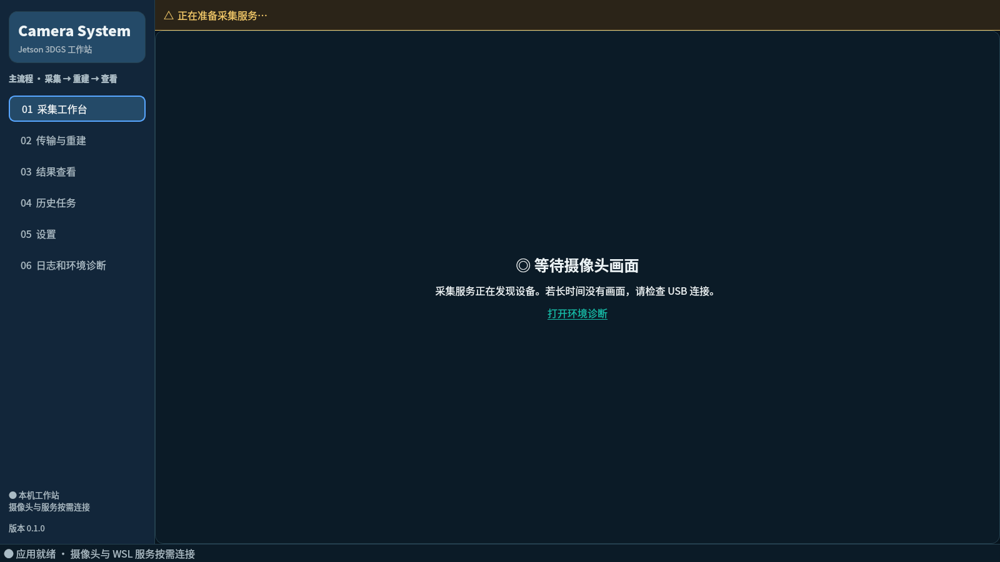
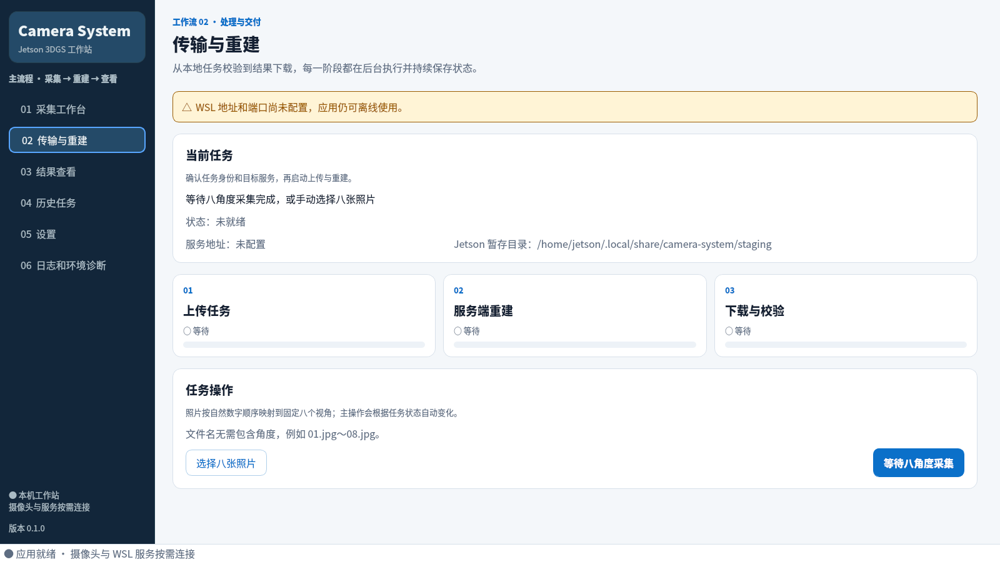

# Camera System：Jetson 多摄像头 3DGS 工作站

最后更新：2026-07-29

Camera System 是运行在 Jetson 上的统一 Qt 桌面应用，串联多摄像头采集、
八视角任务打包、WSL/服务器端 3DGS 重建和 PLY 结果查看。仓库也保留三个
能力子项目，便于独立测试和维护。

## 界面概览

界面按采集、重建、查看三个主阶段组织，并把历史、设置和诊断作为工作站支持
功能。实时采集与 3D 查看使用低眩光深色操作面，配置和任务页面使用浅色
文档面。

| 采集工作台 | 传输与重建 |
|---|---|
|  |  |

六个页面的完整截图、设计令牌、组件和可访问性约定见
[UI 设计系统](docs/development/UI_DESIGN_SYSTEM.md)。

## 支持平台

生产基线是：

- Jetson Orin Nano；
- JetPack 5.1.1、Ubuntu 20.04；
- Python 3.8；
- JetPack/Ubuntu 原生 PyQt5、OpenCV/GStreamer、CUDA、TensorRT 和
  OpenGL/EGL；
- 8 路 V4L2 USB 摄像头；
- Jetson 能通过 HTTP 访问的 WSL 或 Linux 重建服务。

其他 Linux 环境可用于纯 Python 测试，但未作为摄像头、硬件解码或 OpenGL
发布目标。不要用 pip 版本的 Qt 或 OpenCV 覆盖 JetPack 原生组件。

## 功能与仓库边界

| 目录 | 职责 |
|---|---|
| [`src/camera_system_app`](src/camera_system_app) | 统一桌面应用、配置、诊断、工作流与后台任务 |
| [`multiwebcam`](multiwebcam/README.md) | 摄像头发现、预览、录制、八视角采集、质量检查和角度引导 |
| [`Tx_Rx`](Tx_Rx/README.md) | 任务清单、ZIP 上传、重建轮询、断点下载、校验和 ACK |
| [`3DGSviewer/q3dviewer`](3DGSviewer/q3dviewer/README.md) | 点云、网格和 Gaussian Splat 查看 |

`Tx_Rx` 只包含 Jetson 侧 HTTP 客户端和协议模型。本仓库不包含 WSL 接收
服务或 GaussianObject 重建程序；服务端必须另行部署，并实现
[协议对齐记录](docs/releases/TX_RX_PROTOCOL_ALIGNMENT.md)描述的接口。

端到端数据流：

```text
8 路 USB 摄像头
  → 多视角 JPEG、时间戳和质量元数据
  → staging/task.json 与 ZIP
  → HTTP 上传、WSL 重建、状态轮询
  → Range 下载并校验 3DGS.ply
  → 内嵌 Gaussian 查看器
```

## 快速开始

在 Jetson 上进入仓库根目录：

```bash
./scripts/jetson/install.sh
./scripts/jetson/diagnose.sh
./scripts/jetson/run.sh
```

安装脚本会：

1. 检查并安装缺失的 apt 系统包；
2. 创建继承系统包的 `.venv-jetson`；
3. 安装 [`requirements/jetson.txt`](requirements/jetson.txt)；
4. 以 editable 模式安装顶层应用；
5. 初始化用户配置并安装桌面图标。

可用安装选项：

```bash
./scripts/jetson/install.sh --skip-system-packages
./scripts/jetson/install.sh --skip-python-deps
./scripts/jetson/install.sh --no-desktop
```

安装程序默认使用 PyPI。离线或局域网部署可临时指定镜像：

```bash
CAMERA_SYSTEM_PIP_INDEX_URL=http://镜像地址/simple \
  ./scripts/jetson/install.sh
```

安装不会修改 `~/.bashrc`。如果只需要常规 pip 入口，可使用：

```bash
.venv-jetson/bin/python -m pip install -r requirements.txt
```

## 配置

首次安装会从
[`config/examples/settings.yaml`](config/examples/settings.yaml)生成：

```text
~/.config/camera-system/settings.yaml
```

至少确认 WSL 服务地址：

```yaml
wsl_service_url: http://192.168.1.100:8000
```

这里必须填写 Jetson 可访问的主机地址，不能填写 Jetson 自身的
`127.0.0.1`，也不能填写 WSL 文件路径。主要配置项：

| 配置项 | 含义 | 示例默认值 |
|---|---|---|
| `capture_root` | 八视角采集输出目录 | `captures` |
| `transfer_staging_root` | 任务打包临时目录 | `runtime/staging` |
| `result_root` | 校验成功的 PLY 结果目录 | `result` |
| `wsl_service_url` | WSL/服务器 HTTP 根地址 | `http://192.168.1.100:8000` |
| `upload_timeout_seconds` | 上传总超时 | `300` |
| `reconstruction_timeout_seconds` | 重建轮询总超时 | `21600` |
| `download_timeout_seconds` | 下载总超时 | `600` |
| `max_ply_size_bytes` | 可接收 PLY 大小上限 | `2147483648` |

相对路径以仓库或发布目录为基准。也可以通过 `--config` 指定其他 JSON/YAML
配置，通过 `--project-root` 指定工作区根目录：

```bash
./scripts/jetson/run.sh --config /绝对路径/settings.yaml
```

## 使用流程

1. 在“采集工作台”启动摄像头。
2. 按提示完成 `0°、45°、90°、135°、180°、225°、270°、315°` 八个视角。
3. 在“传输与重建”确认任务，上传并等待服务端重建。
4. 应用轮询状态，以 Range 请求下载 PLY，并在 SHA-256 校验成功后原子发布。
5. 在“结果查看”中旋转、缩放、平移或重置 Gaussian 模型视角。
6. 在“历史任务”中重试失败任务或重新打开已有结果。
7. 在“日志和环境诊断”中查看摄像头、依赖、网络和图形环境状态。

没有摄像头或 WSL 服务离线时，应用界面仍能启动；相关页面会显示可操作的
诊断信息。

## 取消、超时与安全退出

应用会把取消请求传播到采集、打包、传输、下载和查看器加载任务，并在失败
或取消时清理未发布的临时文件。为避免误判“卡死”，需注意：

- 大型 PLY 在分块读取、转换和校验边界检查取消；正在执行的单个分块完成后
  才会退出；
- 摄像头发现使用可终止的 V4L2 子进程；驱动打开、预热和设备切换仍可能等到
  当前底层调用或超时边界；
- 文件复制、哈希和任务清单校验在分块边界取消；
- 元数据和 ACK 会在发请求前检查取消；已经发出的 HTTP 操作会在短观察窗口
  或网络超时后返回；
- ACK 带幂等键，重复提交不会代表应重复处理同一结果；
- 关闭窗口时应用先停止后台任务、释放摄像头和 OpenGL 资源，再完成退出。

超时是不可立即中断的系统调用和网络请求的最终退出边界。

## 运行时目录

| 内容 | 默认位置 |
|---|---|
| 用户配置 | `~/.config/camera-system/settings.yaml` |
| 应用日志 | `~/.local/state/camera-system/logs/camera-system.log` |
| 采集结果 | `captures/` |
| 打包暂存 | `runtime/staging/` |
| 重建结果 | `result/` |

采集图片、视频、PLY、日志、模型权重、虚拟环境和 staging 内容均为本机数据，
不应提交到 Git。

## Python 依赖

| 安装目标 | 文件 |
|---|---|
| Jetson 生产运行时 | [`requirements/jetson.txt`](requirements/jetson.txt) |
| 仓库根目录常规入口 | [`requirements.txt`](requirements.txt) |
| 开发与测试 | [`requirements/dev.txt`](requirements/dev.txt) |

完整边界见 [Python 依赖说明](requirements/README.md)和
[Jetson 依赖策略](docs/development/JETSON_DEPENDENCIES.md)。生产环境故意不
包含 pip PySide6、PyQt5、OpenCV、CUDA、TensorRT、Torch 和 ONNX。

## 开发与测试

安装开发依赖：

```bash
.venv-jetson/bin/python -m pip install -r requirements/dev.txt
```

顶层完整测试：

```bash
.venv-jetson/bin/python -m pytest
```

快速验证 Qt 无关的协议与架构：

```bash
.venv-jetson/bin/python -m pytest tests/protocol tests/test_architecture.py
```

子项目测试：

```bash
(cd Tx_Rx && ../.venv-jetson/bin/python -m pytest -q)
(cd multiwebcam && \
  LD_PRELOAD=/lib/aarch64-linux-gnu/libGLdispatch.so.0 \
  PYTHONPATH=src .venv-jetson/bin/python -m pytest -q)
```

真实摄像头和 OpenGL 验证必须在 Jetson 图形会话中执行。无 X11 的 SSH 会话
只能运行非硬件测试和 `--diagnose`。

命令行入口：

```bash
./scripts/jetson/run.sh --help
./scripts/jetson/run.sh --version
./scripts/jetson/diagnose.sh --json
```

## 发布

生成 Jetson arm64 发布目录、压缩包和 SHA-256 文件：

```bash
./scripts/jetson/release.sh
```

自定义输出目录：

```bash
./scripts/jetson/release.sh --output /绝对路径/dist
```

发布流程和验收清单见
[Jetson 发布说明](docs/releases/JETSON_RELEASE.md)。

## 常见问题

- **诊断提示 GStreamer 不可用**：卸载 pip 的 `opencv-python*`，重新运行
  安装脚本，确保 `cv2` 来自 JetPack/Ubuntu。
- **Qt 提示无法加载 xcb**：确认在本机桌面会话运行，并检查
  `libxcb-xinerama0`、`libxcb-xinput0` 和 Qt 平台插件路径。
- **OpenGL 黑屏或 TLS block 错误**：使用 `scripts/jetson/run.sh` 启动；
  它会在 aarch64 上预加载系统 `libGLdispatch.so.0`。
- **WSL 连接失败**：确认服务监听 `0.0.0.0`、Jetson 能访问目标 IP、端口和
  防火墙已放行。
- **PLY 下载或校验失败**：检查磁盘空间、服务端长度和 SHA-256 元数据后重试；
  只有校验成功的结果才会发布。
- **`pip check` 报 `testresources`、`onnx` 或 Qt 版本不一致**：这些可能来自
  继承的 Ubuntu/NVIDIA 包或可选工具。以 `./scripts/jetson/diagnose.sh`
  的核心依赖结果为验收依据。
- **窗口关闭仍需短暂等待**：应用正在等待当前驱动、文件分块或网络超时边界，
  不要强制断电；日志会记录停止进度。

## 文档

- [Jetson 用户操作说明](docs/user/JETSON_USER_GUIDE.md)
- [架构与开发约定](docs/development/ARCHITECTURE.md)
- [UI 设计系统与截图基线](docs/development/UI_DESIGN_SYSTEM.md)
- [全部文档索引](docs/README.md)
- [multiwebcam 文档索引](multiwebcam/docs/README.md)
- [Tx_Rx 当前实现报告](Tx_Rx/markdown/TX纯Python_HTTP客户端实现报告.md)
- [q3dviewer 发布与工具说明](3DGSviewer/q3dviewer/docs/release.md)

开发过程中的 `status`、审查报告和实现报告是特定时点的记录；用户安装和
运行方式以本 README、用户操作说明及发布说明为准。
